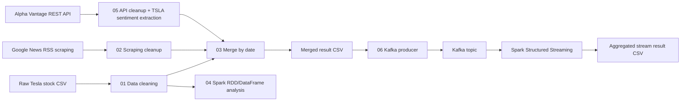

<<<<<<< HEAD
# BDE Financial News & Stock Project — Tesla

This repository contains a Big Data Engineering project about Tesla stock data and Tesla-related financial news.

## Project story

The project combines Tesla market data with news data to answer the following question:

> How do Tesla-related news volume and sentiment appear around the available Tesla stock data?

The focus is not on building a perfect financial prediction model. The focus is the data engineering pipeline: collecting different data sources, cleaning and transforming them, sending data through Kafka, processing it with Spark, storing results and visualizing the final output.

## Data sources

| Source type | Dataset | Location / notebook |
|---|---|---|
| File source | Tesla stock price CSV | `data/raw/tesla_stock_data_raw.csv`, `notebooks/01_data_cleaning_tesla.ipynb` |
| Web scraping | Google News RSS search for Tesla stock news | `notebooks/02_data_scraping_tesla.ipynb` |
| REST API | Alpha Vantage News & Sentiment API for TSLA | `notebooks/05_rest_api_alpha_vantage_news.ipynb` |

## Pipeline overview



## Main notebooks

Run the notebooks in this order:

1. `notebooks/01_data_cleaning_tesla.ipynb`  
   Cleans the Tesla stock CSV and creates additional columns such as daily return, price range and moving averages.
2. `notebooks/02_data_scraping_tesla.ipynb`  
   Scrapes Tesla stock-related news from Google News RSS and stores raw and cleaned news data.
3. `notebooks/05_rest_api_alpha_vantage_news.ipynb`  
   Collects TSLA-related financial news via Alpha Vantage REST API and extracts TSLA-specific sentiment values from the API response.
4. `notebooks/03_data_merging_tesla.ipynb`  
   Merges stock, scraped news and API news into one result dataset.
5. `notebooks/04_data_spark_tesla.ipynb`  
   Uses Spark RDD and Spark DataFrames for batch analysis of stock data.
6. `notebooks/06_kafka_spark_streaming_tesla.ipynb`  
   Sends the merged dataset to Kafka and processes it with Spark Structured Streaming.

## Important output files

| File | Description |
|---|---|
| `data/processed/tesla_stock_data_cleaned.csv` | Cleaned stock data |
| `data/processed/tesla_news_cleaned.csv` | Cleaned scraped news data |
| `data/processed/alpha_vantage_tesla_news_cleaned.csv` | Cleaned API news data with TSLA-specific sentiment columns |
| `data/results/tesla_stock_news_merged.csv` | Final merged dataset used for Kafka streaming |
| `data/results/tesla_kafka_stream_summary.csv` | Aggregated streaming-style result for presentation |

## Kafka / Spark configuration

The Kafka notebook uses the BDENG broker by default:

```python
KAFKA_BROKER = "172.29.16.101:9092"
```

For a local Kafka setup, set an environment variable before running the notebook:

```bash
export KAFKA_BROKER=localhost:9092
```

The REST API notebook does not hardcode a private API key. For a fresh API request, set:

```bash
export ALPHA_VANTAGE_API_KEY=your_key_here
```

If no fresh API response is available, the notebook can use the cached raw API CSV already stored in `data/raw/`.

## Notes for submission

- The project contains the required three source types: file, web scraping and REST API.
- Kafka is used as a broker in notebook `06_kafka_spark_streaming_tesla.ipynb`.
- Spark reads from Kafka and processes the stream in notebook `06_kafka_spark_streaming_tesla.ipynb`.
- Results are stored as CSV and Parquet files in `data/results/`.
- The data flow is documented in the Mermaid diagram above.
=======
```
BDE-financial-news-stock-project
├─ data
│  ├─ processed
│  │  └─ tesla_stock_data_cleaned.csv
│  └─ raw
│     └─ tesla_stock_data_raw.csv
├─ docker-compose.yml
├─ notebooks
│  ├─ 01_data_cleaning_tesla.ipynb
│  └─ web_scraping.ipynb
└─ README.md

```
>>>>>>> 35b943fed6c18bc35e2fd6b15bc4b5c48c52debc
